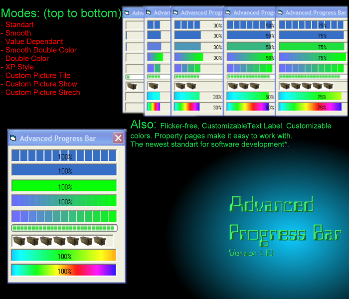



## Advanced Progress Bar \(1\.10\)

### Description

Tired of the old Windows Progress Bar that you can't customize? Here is teh anser: Use APB v 1.10. Features: Standart, Smooth, Double Color Normal/Smooth, XPStyle, CustomPicture Tile/Strech/Show modes. You can customize colors and graphics used, font for the label if you choose to diplay it.

It is flicker-free, proffessional, and fully customizable!.

----

FROM THE MAKER OF THE ADVANCED PROGRESS BAR, THIS NEW APB HAS EVEN MORE FEATURES!
 
### More Info
 

             |
---                |---
**Submitted On**   |2002-03-09 21:18:28
**By**             |[XA](https://github.com/Planet-Source-Code/PSCIndex/blob/master/ByAuthor/xa.md)
**Level**          |Intermediate
**User Rating**    |4.8 (91 globes from 19 users)
**Compatibility**  |VB 5\.0, VB 6\.0, VBA MS Access, VBA MS Excel
**Category**       |[OLE/ COM/ DCOM/ Active\-X](https://github.com/Planet-Source-Code/PSCIndex/blob/master/ByCategory/ole-com-dcom-active-x__1-29.md)
**World**          |[Visual Basic](https://github.com/Planet-Source-Code/PSCIndex/blob/master/ByWorld/visual-basic.md)
**Archive File**   |[Advanced\_P608763102002\.zip](https://github.com/Planet-Source-Code/xa-advanced-progress-bar-1-10__1-32527/archive/master.zip)

